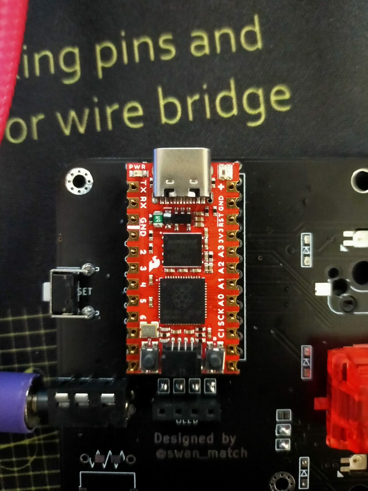

# 使い方

1. RP2040をsilverbullet44の枠のの書いてないほうに刺します。t
2. https://github.com/picoruby/prk_firmware/releases から最新のuf2ファイルをダウンロードします。
    
  
    

3. RP2040とPCをUSBに差し込むと、ファイルシステムがマウントされるので、「2.」でダウンロードしたuf2ファイルを書き込みます。
4. 再マウントされるファイルシステムに`keymap.rb`をドラッグドロップします。

# その他

詳しくは[公式ドキュメント](https://github.com/picoruby/prk_firmware)を見てね！